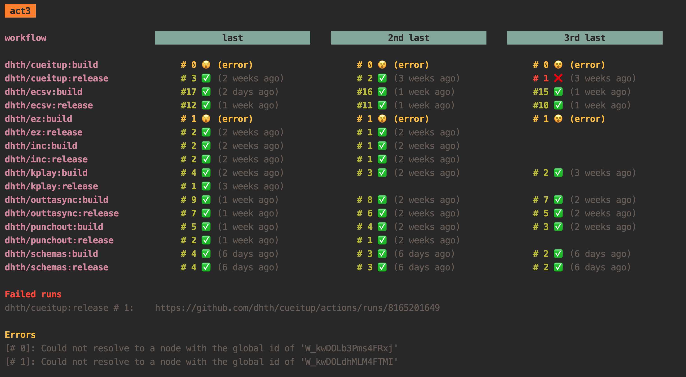
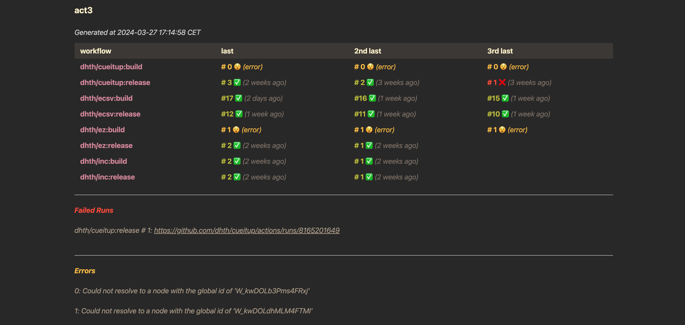

# act3

✨ Overview
---

Glance at the results of the last 3 runs of your Github Actions.

<p align="center">
  
</p>

💾 Installation
---

**homebrew**:

```sh
brew install dhth/tap/act3
```

**go**:

```sh
go install github.com/dhth/act3@latest
```

🛠️ Configuration
---

### Access Token

`act3` requires an environment variable `ACT3_GH_ACCESS_TOKEN` which needs to
have the following permissions for the repositories that are to be queried for.

- `actions:read`
- `checks:read`

### Configuration file

Create a config file that looks like the following (`act3` will look for this
file at `~/.config/act3/act3.yml.` by default).

```yaml
workflows:

- id: W_kwDOLkC0eM4FaKV_
  repo: dhth/act3
  name: build
  url: https://asampleurl.com/{{runNumber}}
- id: W_kwDOLkC0eM4FaKWA
  repo: dhth/act3
  name: release
  url: https://asampleurl.com/{{runNumber}}

- id: W_kwDOLb3Pms4FRxjX
  repo: dhth/cueitup
  name: build
  url: https://dhth.github.io/cueitup
- id: W_kwDOLb3Pms4FRxjY
  repo: dhth/cueitup
  name: release
  url: https://dhth.github.io/cueitup

- id: W_kwDOLghtl84FWTlZ
  repo: dhth/ecsv
  name: build
- id: W_kwDOLghtl84FWTla
  repo: dhth/ecsv
  name: release
```

`{{runNumber}}` gets replaced with the actual run number of the workflow.

You can find the ID for your workflow as follows:

```bash
curl -L \
  -H "Accept: application/vnd.github+json" \
  -H "Authorization: Bearer <YOUR_GH_TOKEN>" \
  -H "X-GitHub-Api-Version: 2022-11-28" \
  https://api.github.com/repos/<OWNER>/<REPO>/actions/workflows/<WORKFLOW_FILE>

# or

gh api repos/<OWNER>/<REPO>/actions/workflows/<WORKFLOW_FILE>

# use node_id from the response
```

⚡️ Usage

### CLI output

```bash
act3"
```

### HTML output

`act3` can also output the results in HTML format.


```bash
act3" \
    -config-file=./examples/html/act3.yml \
    -format=html \
    -html-template-file=./examples/html/template.html
```

The resultant HTML page looks like this.

<p align="center">
  
</p>

A sample page generated via `act3` is running at
[https://dhth.github.io/act3](https://dhth.github.io/act3), the source code for
which is in the [examples/html](./examples/html) directory.

Acknowledgements
---

`act3` is built using the TUI framework [bubbletea][1].

[1]: https://github.com/charmbracelet/bubbletea
